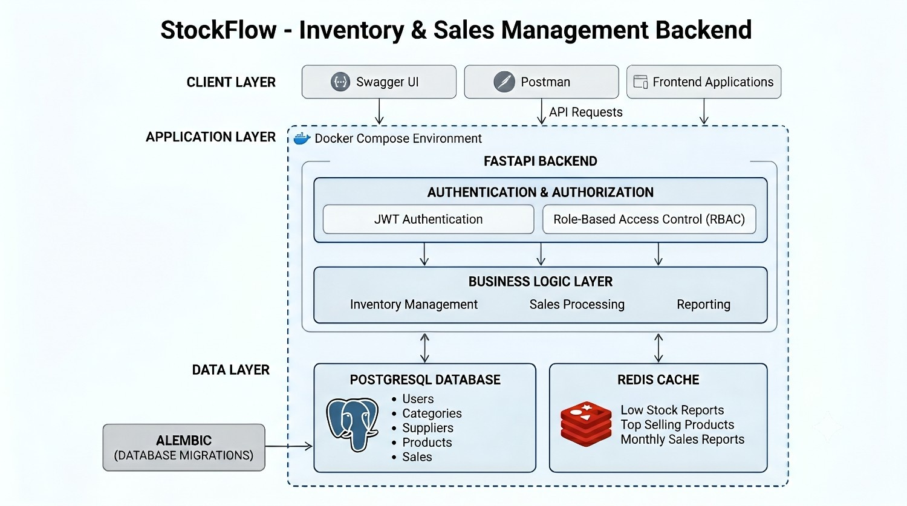
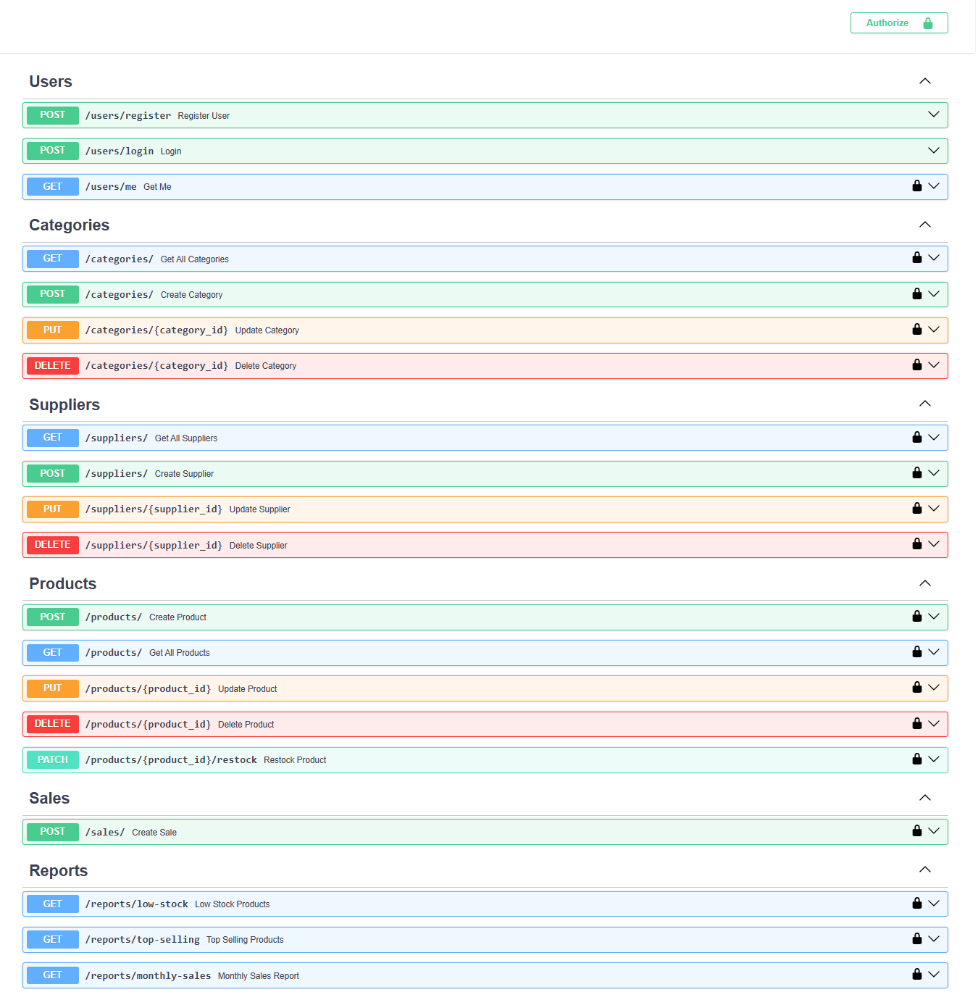

# StockFlow - Inventory & Sales Management Backend

A production-style backend system for inventory tracking, supplier management, sales processing, and business reporting.

Built with FastAPI, PostgreSQL, Redis, and Docker using a layered architecture and industry-standard backend practices.

---

## Overview

StockFlow helps businesses manage products, suppliers, inventory, and sales while providing analytical reports such as low-stock monitoring, top-selling products, and monthly sales summaries.

The project demonstrates backend engineering concepts including authentication, authorization, caching, database migrations, containerization, and reporting APIs.

---

## Highlights

- Built a production-style FastAPI backend application
- Implemented JWT Authentication and RBAC
- Designed PostgreSQL database with SQLAlchemy ORM
- Integrated Redis caching for reporting APIs
- Dockerized application using Docker Compose
- Managed schema changes with Alembic migrations

## System Architecture



## API Documentation Preview

### Swagger UI Overview



## Key Features

### Authentication & Authorization

* JWT Authentication
* Secure Password Hashing
* Role-Based Access Control (RBAC)
* Protected API Endpoints

### Inventory Management

* Category Management
* Supplier Management
* Product Management
* Product Restocking
* Inventory Tracking
* Stock Quantity Updates

### Sales Management

* Sales Processing
* Automatic Inventory Deduction
* Transaction Recording

### Reporting & Analytics

* Low Stock Report
* Top Selling Products Report
* Monthly Sales Summary
* Redis Cached Reporting APIs

### Performance Optimization

* Redis Caching
* Cache Expiration (TTL)
* Cache Invalidation Strategy

### DevOps & Deployment

* Dockerized Application
* Docker Compose Setup
* PostgreSQL Container
* Redis Container
* Environment-Based Configuration

---

## Tech Stack

| Category         | Technologies           |
| ---------------- | ---------------------- |
| Backend          | FastAPI, Python        |
| Database         | PostgreSQL             |
| ORM              | SQLAlchemy             |
| Migrations       | Alembic                |
| Authentication   | JWT                    |
| Validation       | Pydantic               |
| Caching          | Redis                  |
| Containerization | Docker, Docker Compose |

---

## Project Structure

```text
app/
├── api/
├── core/
├── db/
├── models/
├── schemas/
├── services/
├── utils/

alembic/
```

### Architectural Concepts

* Layered Architecture
* Service Layer Pattern
* Dependency Injection
* RESTful API Design
* Database Relationships
* Environment-Based Configuration
* Redis Caching Strategy

---

## API Features

### Authentication

```http
POST /users/register
POST /users/login
```

### Categories

```http
GET    /categories
POST   /categories
PUT    /categories/{id}
DELETE /categories/{id}
```

### Suppliers

```http
GET    /suppliers
POST   /suppliers
PUT    /suppliers/{id}
DELETE /suppliers/{id}
```

### Products

```http
GET    /products
POST   /products
PUT    /products/{id}
DELETE /products/{id}
PATCH  /products/{id}/restock
```

### Sales

```http
POST /sales
```

### Reports

```http
GET /reports/low-stock
GET /reports/top-selling
GET /reports/monthly-sales
```

---

## Local Development Setup

### Clone Repository

```bash
git clone https://github.com/karthick-vm/stockflow-backend.git
cd stockflow-backend
```

### Create Virtual Environment

```bash
python -m venv venv
```

### Activate Virtual Environment

Windows

```bash
venv\Scripts\activate
```

Linux / Mac

```bash
source venv/bin/activate
```

### Install Dependencies

```bash
pip install -r requirements.txt
```

### Run Database Migrations

```bash
alembic upgrade head
```

### Start Application

```bash
uvicorn app.main:app --reload
```

---

## Docker Setup

### Build and Run

```bash
docker compose up --build
```

### Stop Containers

```bash
docker compose down
```

### Services

* FastAPI Application
* PostgreSQL Database
* Redis Cache

---

## API Documentation

Swagger UI:

```text
http://localhost:8000/docs
```

ReDoc:

```text
http://localhost:8000/redoc
```

---

## Skills Demonstrated

* Backend Development with FastAPI
* REST API Design
* JWT Authentication
* Role-Based Authorization
* PostgreSQL Database Design
* SQLAlchemy ORM
* Alembic Database Migrations
* Redis Caching
* Docker Containerization
* Service Layer Architecture
* Inventory Management Systems
* Reporting & Analytics APIs

